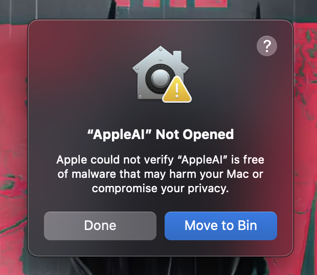
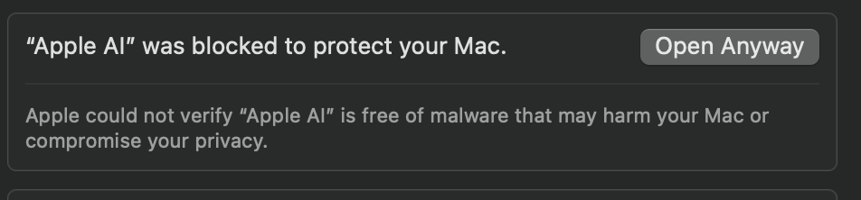

# Apple AI

## 🎉 Version 2.0 Now Available! 🎉

A MacOS menu bar app that brings 10+ AI models (ChatGPT, Claude, Perplexity, Copilot, DeepSeek, Grok, Mistral, Gemini, Pi, and more) + Custom API + Screenshot and Continue Chat into one streamlined interface, accessible anywhere with a global ⌘E shortcut. [Click here](https://www.theappleai.tech/pricing)

## Download Now

### Visit the Official Website

- Go to [www.theappleai.tech](https://www.theappleai.tech) to download the latest version of DMG
- **Version 2.0** features improved performance, enhanced UI, and exciting new features

  

  <h2>⭐ Support Apple AI Development ⭐</h2>
  
Apple AI is an independent project committed to making AI tools more accessible and efficient on macOS.

  
<strong>If you find this tool valuable for your workflow, please consider supporting its continued development:</strong>

  
  <table>
    <tr>
      <td align="center">
        
        
<strong>UPI</strong>

      </td>
      <td align="center">
        
        
<strong>PayPal</strong>

      </td>
    </tr>
  </table>
  
  
<em>Your support enables us to bring regular updates, integrate new AI services, and improve existing features. Every contribution helps maintain and evolve this project. Thank you for your support! ❤️</em>

  

## App Preview

## Overview

Apple AI transforms how you interact with AI tools on your Mac by bringing together powerful AI assistants in one convenient menu bar application. Access it instantly from anywhere with the global ⌘E shortcut.

Available AI services:
- ChatGPT
- Claude 
- GitHub Copilot
- Perplexity
- DeepSeek
- Grok
- Mistral AI
- Google Gemini
- Pi
- Custom API

Each assistant maintains its own persistent session, allowing you to seamlessly switch between them while preserving context and conversation history.

## Key Features

- **Global ⌘E Shortcut**: Toggle the app window from anywhere on your Mac with Command+E
- **Always on Top Mode**: Keep the window visible even when clicking outside
- **Pinnable Interface**: Pin the AI interface to keep it accessible while working in other applications
- **Screenshot and Chat**: Take a screenshot and automatically open Apple AI with the captured image ready to be shared with your favorite AI assistant

- **Instant Menu Bar Access**: One-click access to all AI assistants from the menu bar
- **Native Performance**: Built as a native macOS app for optimal speed and reliability
- **Persistent Sessions**: Maintains context across app restarts
- **Resource Efficient**: Lightweight compared to multiple browser tabs
- **Clean Interface**: Modern, distraction-free design following macOS guidelines
- **Customizable Themes**: Light and dark mode with accent color options
- **Smart History**: Search and reference past conversations
- **Privacy Focused**: All data stored locally by default
- **Full Keyboard Support**: Copy, paste, and select all functionality in all AI chat inputs

## Keyboard Shortcuts

Apple AI provides system-wide keyboard shortcuts for quick access:

- **⌘E**: Toggle Apple AI window open/closed (works globally across all applications)
- **Copy/Paste/Select All**: Standard keyboard shortcuts (⌘C, ⌘V, ⌘A) work in all AI chat input fields
## Preferences

Apple AI offers several customization options:

- **Always on Top**: When enabled, the app window stays visible even when clicking outside it
- **Open at Login**: Automatically start Apple AI when you log in
- **Keyboard Shortcuts**: View the configured keyboard shortcuts

To access preferences, click the Apple AI menu bar icon and select "Preferences".

## Perfect For

- **Developers**: Quick access to coding assistants like GitHub Copilot
- **Writers**: Seamless writing help from ChatGPT and Claude
- **Researchers**: Efficient fact-checking with Perplexity
- **Knowledge Workers**: Rapid answers from multiple AI sources
- **Creative Professionals**: Instant creative inspiration
- **Students**: Research assistance and learning support
- **Business Users**: Quick market research and analysis
- **Data Scientists**: Rapid prototyping and code generation

## Installation Notes

### First Launch Security
- When launching Apple AI for the first time, you may encounter a security warning due to macOS's Gatekeeper feature
- Click "Done" one time to bypass the warning

- Go to System Settings > Privacy & Security > Scroll to the bottom > click on "Open Anyway"

## Security Considerations

Apple AI is designed with privacy in mind:
- The app simply provides a native interface to web-based AI services
- No data is sent to any servers beyond what you directly input to each AI service
- All preferences and settings are stored locally on your Mac

## Compatibility

### macOS Requirements
- Apple AI works on macOS Monterey (12.0) and later

- **Compatible with both Apple Silicon (M1/M2/M3) and Intel Macs**