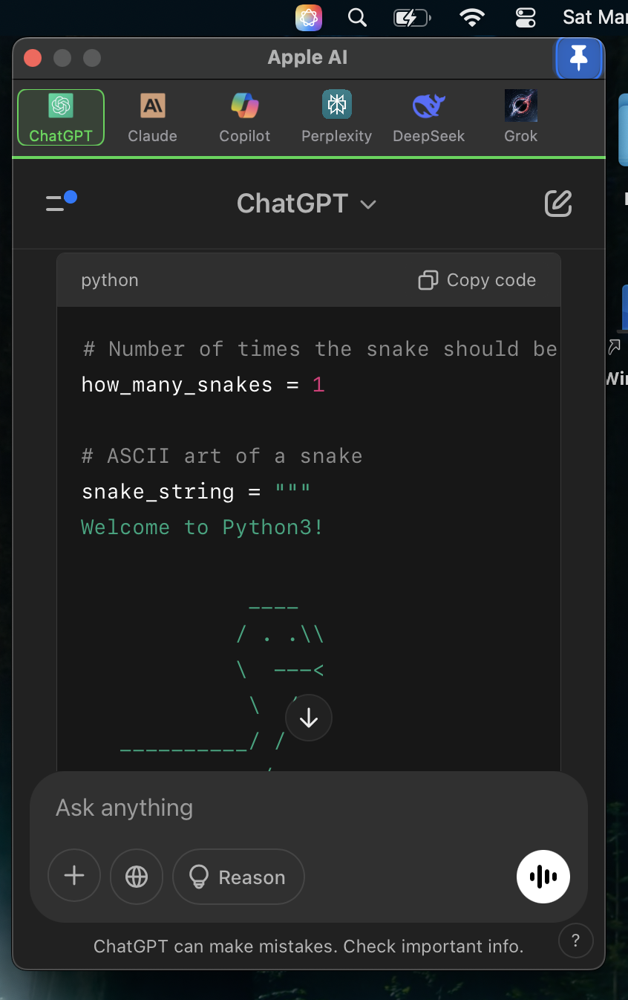

# Apple AI

Apple AI is a native macOS menu bar app that integrates top AI assistants like ChatGPT, Claude, GitHub Copilot, Perplexity, DeepSeek, and Grok into one streamlined interface

## Overview

Apple AI transforms how you interact with AI tools on your Mac by bringing together powerful AI assistants in one convenient menu bar application:

- ChatGPT
- Claude 
- GitHub Copilot
- Perplexity
- DeepSeek
- Grok

Each assistant maintains its own persistent session, allowing you to seamlessly switch between them while preserving context and conversation history.

## Key Features

- **Instant Menu Bar Access**: One-click access to all AI assistants from the menu bar
- **Native Performance**: Built as a native macOS app for optimal speed and reliability 
- **Persistent Sessions**: Maintains context across app restarts
- **Resource Efficient**: Lightweight compared to multiple browser tabs
- **Clean Interface**: Modern, distraction-free design following macOS guidelines
- **Customizable Themes**: Light and dark mode with accent color options
- **Smart History**: Search and reference past conversations
- **Privacy Focused**: All data stored locally by default

## Perfect For

- **Developers**: Quick access to coding assistants like GitHub Copilot
- **Writers**: Seamless writing help from ChatGPT and Claude
- **Researchers**: Efficient fact-checking with Perplexity
- **Knowledge Workers**: Rapid answers from multiple AI sources
- **Creative Professionals**: Instant creative inspiration
- **Students**: Research assistance and learning support
- **Business Users**: Quick market research and analysis
- **Data Scientists**: Rapid prototyping and code generation

## Technical Details

- Built natively for Apple Silicon and Intel Macs
- Written in Swift using SwiftUI framework
- Minimal CPU and memory footprint
- Regular updates and maintenance
- Active community support

## Getting Started

1. **Download & Install**
   - Visit the [Releases](https://github.com/bunnysayzz/appleai/releases) page
   - Download the latest `Apple.AI.dmg` file
   - Open the downloaded DMG file
   - Drag Apple AI.app to your Applications folder
   - Launch the app from Applications or Spotlight
   - If you see a security warning, go to System Settings > Privacy & Security and click "Open Anyway"

## License

MIT License

Copyright (c) 2025 Apple AI

Permission is hereby granted, free of charge, to any person obtaining a copy
of this software and associated documentation files (the "Software"), to deal
in the Software without restriction, including without limitation the rights
to use, copy, modify, merge, publish, distribute, sublicense, and/or sell
copies of the Software, and to permit persons to whom the Software is
furnished to do so, subject to the following conditions:

The above copyright notice and this permission notice shall be included in all
copies or substantial portions of the Software.

THE SOFTWARE IS PROVIDED "AS IS", WITHOUT WARRANTY OF ANY KIND, EXPRESS OR
IMPLIED, INCLUDING BUT NOT LIMITED TO THE WARRANTIES OF MERCHANTABILITY,
FITNESS FOR A PARTICULAR PURPOSE AND NONINFRINGEMENT. IN NO EVENT SHALL THE
AUTHORS OR COPYRIGHT HOLDERS BE LIABLE FOR ANY CLAIM, DAMAGES OR OTHER
LIABILITY, WHETHER IN AN ACTION OF CONTRACT, TORT OR OTHERWISE, ARISING FROM,
OUT OF OR IN CONNECTION WITH THE SOFTWARE OR THE USE OR OTHER DEALINGS IN THE
SOFTWARE.
